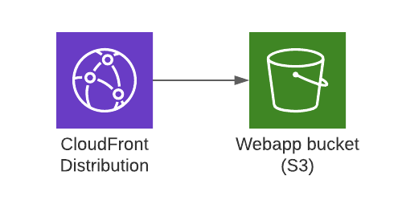

# CUP Tech Test

## Setup and scripts

This project was bootstrapped with [Create React App](https://github.com/facebook/create-react-app). As such you can run `npm i` to install dependencies and run the standard `start`, `test`, `build` and `eject` scripts configured by create react app.

I have added the following additional scripts:
```sh
npm run lint
```

which will run eslint. The eslint config can be found in `package.json`

```sh
npm run lint:fix
```

runs the `npm run lint` command with the `--fix` flag provided to auto-fix any issues that are compatible with the fix flag. 

## Structure

The repo is more or less using the standard create-react-app structure with the addition of the folowing directories for organisation:

`src/api` contains a single api.ts file which contains the code for making the network request, validating the response, processing the response into a more suitable model and the TS types. In a larger application you would split this logic up but I have left it together as the use case is much simpler and having all the code in one file made development faster. 

`src/components` A directory for all custom components. There is a `Utils.ts` file which is acting like a simple component library by exporting a number of basic components.

`src/pages` A directory that contains components that act more like pages, these are used by react router. 

## Styling

I have configured tailwind for styling. I have never used it before, so I thought I would use this exercise as an excuse to play with it. I must say, I don't know if I am a fan so far but perhaps I am just not used to it. The configuration for tailwind can be found in `./tailwind.config.js`

## Hosting

in the `./infrastructure` directory you can find a basic CloudFormation template and config file used to deploy the infrastructure the app is hosted on. The app is built as an SPA and then stored in S3. A CloudFront is configured to act as a CDN in front of the S3 bucket as per AWS best practices. See the following diagram:



Due to my desire to use CloudFront and the lack of CORS headers on the API response I added an additional origin to the CloudFront pointed at the path-style S3 URL and a behaviour that routes the `/interview.mock.data/*` path.

The app is deployed manually by running the `deploy.sh` script at the root of the repo. It will do the following:

1. Build the app
2. Deploy the CloudFormation
3. Upload the data to S3
4. Create a CloudFront invalidation

## Notes

- The api endpoint is currently hardcoded in `src/api/api.ts`. Ideally this should be in a config file but I have decided to leave it for the purposes of this exercise. 
- `src/api/api.ts` would normally be split up, how you would split it would depend on a number of factors. However, for simplicity I have left it in a single file. 
- `src/components/Activity.tsx` could probably do with being split up for readability, at minimum it would probably be sensible to create a results component. However, I have decided to leave it for the time being due to there being no reuse of the components and to save time. 


## Assumptions

- An Activity will never have a mix of direct questions and rounds